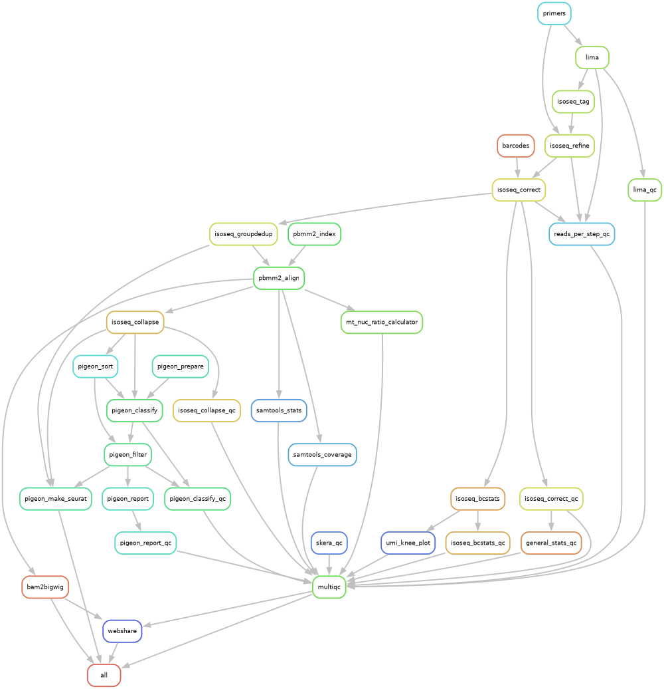

<!--  -->


# Long-read Repeat Element pipeline 
for PacBio single-cell MAS-seq data

## LoRE workflow

<details>
<summary>Expand minimal workflow</summary>


</details>

<details>
<summary>Expand maximal workflow</summary>


</details>


### Underlying MAS-Seq workflow overview

<details>
<summary>Expand</summary>


</details>


## How install LoRE:

Clone the repository:
```[bash]
git clone https://github.com/siebrenf/lore.git
```

Create the conda environment:
```[bash]
conda env create -n lore -f lore/requirements.yaml
conda activate lore
```

Install LoRE in the conda environment:
```[bash]
pip install -e ./lore
```


## How to run LoRE:

Change directory into the LoRE folder.

Activate the conda environment:
```[bash]
conda activate lore
```

Update the `config.yaml`. 
- Adapters, primers and barcodes for the 5' Kinnex kit can be downloaded by lore, or can be placed inside the results directory. 
- The results directory (as well as any other directory) can be set in the config.
  The default results directory is `./results`.
- The genome and gene annotation need to be obtained manually.
  You will need to specify their locations in the config, as well as the symbol for the mitochondria.
  - If the `pigeon classify` output suggests the number of reads per cell is low,
    this may suggest the genome and/or gene annotation were insufficiently annotated.
- Additional documentation for most rules (steps) in the workflow can be found in the code.
- Optional outputs (currently) include bigwigs (for track visualization) and a QC report.
  Both are recommended, but adds (some) computational load.

Test your config:
```[bash]
snakemake --snakefile lore/Snakefile --configfile config.yaml --dry-run
```

Run your config:
```[bash]
nice snakemake --use-conda --snakefile lore/Snakefile --configfile config.yaml --resources parallel_downloads=1 mem_mb=100_000 -j 60 > log.txt 2>&1
```


## Further reading:
  - [PacBio docs](https://isoseq.how/getting-started.html#recommended-single-cell-iso-seq-workflow)
  - [PacBio repos](https://github.com/PacificBiosciences/pbbioconda)
  - [PacBio datasets](https://downloads.pacbcloud.com/public/dataset/Kinnex-single-cell-RNA/)
  - [PacBio glossary](https://www.pacb.com/wp-content/uploads/2015/09/Pacific-Biosciences-Glossary-of-Terms.pdf)


## TODO:
  - implement TE/RE detection using the output of either:
    - `isoseq_groupdedup` (an unaligned FASTA and BAM file)
    - `pbmm2_align` (an aligned BAM file)
    - repositories of interest to this purpose have been marked below.
  - learn more about the `pigeon classify` filter settings (for the gene level, some filters may be more lenient).
  - integrate genomepy to get a genome & gene annotation.
    - figure out the requirements for a "good" reference genome & gene annotation.

### Repositories of interest for TE/RE detection:
  - de novo Repeat library construction pipelines
    - https://doi.org/10.1186/s12864-021-08117-9
      - https://github.com/kacst-bioinfo-lab/TE_ideintification_pipeline  # nice workflow figure
      - could be useful for non-model organisms/strains
  - RE/TE pipelines
    - TrEMOLO
      - looks good + snakemake!
      - https://doi.org/10.1186/s13059-023-02911-2
      - https://github.com/DrosophilaGenomeEvolution/TrEMOLO
    - tldr
      - looks easy to use
      - https://doi.org/10.1016/j.molcel.2020.10.024
      - https://github.com/adamewing/tldr
      - works with "partial detection, assembly and annotation of non-reference TE insertions"
    - TELR
      - looks good! pure python
      - https://doi.org/10.1093/nar/gkac794
      - https://github.com/bergmanlab/TELR
      - "relies on the detection of abnormally mapped reads upon the reference genome that can be linked to a TE"
    - teNanoporePipeline
      - may be usable
      - https://doi.org/10.1016/j.isci.2023.108214
      - https://github.com/javiercguard/teNanoporePipeline
      - Tools: RepeatMaster, Dfam
    - LoRTE
      - not usable (python 2!)
      - https://doi.org/10.1186/s13100-017-0088-x
      - dead link
