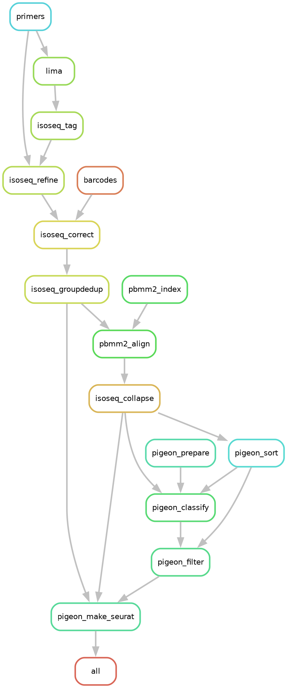

# Long-read Repeat Element pipeline for PacBio single-cell MAS-seq data

## LoRE workflow
<details>
<summary>Expand</summary>


</details>

## MAS-Seq workflow
<details>s
<summary>Expand</summary>


</details>

## How to run LORE:

Test your config:
```[bash]
snakemake --snakefile lore/Snakefile --configfile config.yaml --dry-run
```

Run your config:
```[bash]
nice snakemake --use-conda --snakefile lore/Snakefile --configfile config.yaml --resources parallel_downloads=1 mem_mb=100_000 -j 60 > log.txt 2>&1
```

## Further reading:
  - [PacBio docs](https://isoseq.how/getting-started.html#recommended-single-cell-iso-seq-workflow)
  - [PacBio repos](https://github.com/PacificBiosciences/pbbioconda)
  - [PacBio datasets](https://downloads.pacbcloud.com/public/dataset/Kinnex-single-cell-RNA/)
  - [PacBio glossary](https://www.pacb.com/wp-content/uploads/2015/09/Pacific-Biosciences-Glossary-of-Terms.pdf)

## WIP:
  - TE pipelines:
    - https://doi.org/10.1016/j.isci.2023.108214
      - https://github.com/javiercguard/teNanoporePipeline  # usable
      - RepeatMaster
      - Dfam
    - https://doi.org/10.1093/nar/gkac794
      - https://github.com/bergmanlab/TELR  # looks good!
    - https://doi.org/10.1186/s13059-023-02911-2
      - https://github.com/DrosophilaGenomeEvolution/TrEMOLO  # looks good + snakemake!
    - https://doi.org/10.1186/s13100-017-0088-x
      - LoRTE  # python 2.7, dead link
    - de novo Repeat library construction:
      - could be useful for non-model organisms/strains
      - https://doi.org/10.1186/s12864-021-08117-9
      - https://github.com/kacst-bioinfo-lab/TE_ideintification_pipeline  # nice workflow figure
  
  - MultiQC report containing:
    - skera [x]
    - lima [x]
    - isoseq refine [x]
    - isoseq correct
      - report [x]
      - bcstats: table
      - plots: https://isoseq.how/umi/cell-calling.html
    - pbmm2
      - samtools [x]
    - isoseq collapse
      - report
    - pigeon classify
      - summary
      - filtered summary
      - report
      - report summary
    - pigeon report
      - saturation
    - qc
      - all figures
  
  - what to do with pbmm2 unmapped reads:
    - second pass to the alignment stage to specifically map repeat elements?
    - omit?
  - Optionally merge SMRT cells:
    https://isoseq.how/umi/cli-workflow.html#step-4b---merge-smrt-cells
  - integrate genomepy to:
    - get a genome
    - create the minimap2 index
    - get an annotation
